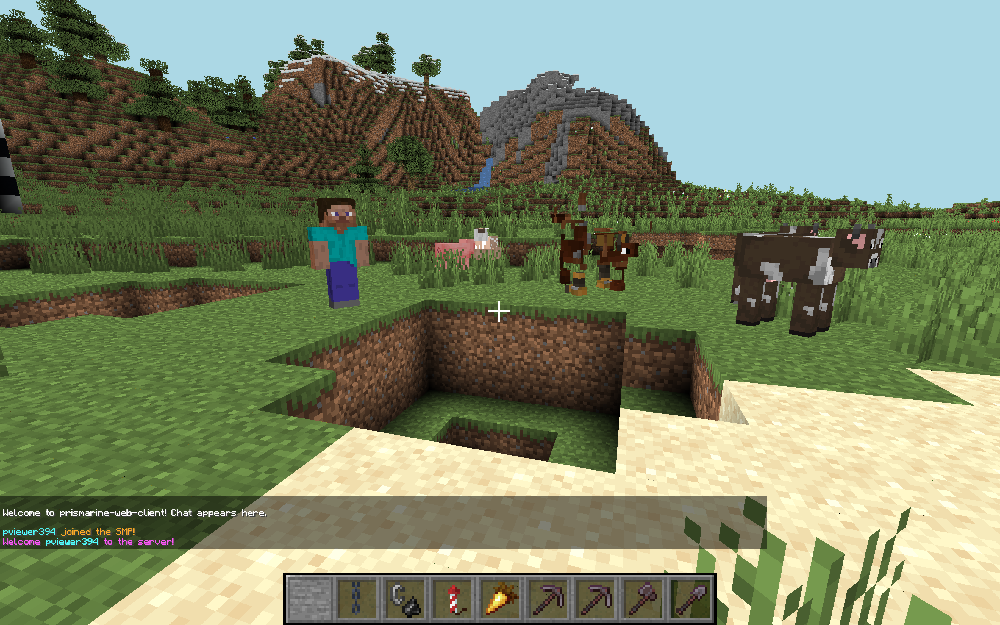

# prismarine-web-client
[](http://npmjs.com/package/prismarine-web-client)
[](https://github.com/PrismarineJS/prismarine-web-client/actions?query=workflow%3A%22CI%22)
[](https://discord.gg/GsEFRM8)
[](https://gitpod.io/#https://github.com/PrismarineJS/prismarine-web-client)

A Minecraft client running in a web page. **Live demo at https://webclient.prismarine.js.org/**


## How it Works
prismarine-web-client runs mineflayer and prismarine-viewer in the browser, which connects over WebSocket to a proxy 
which translates the WebSocket connection into TCP to connect to normal Minecraft servers. Prismarine-web-client is based on:
* [prismarine-viewer](https://github.com/PrismarineJS/prismarine-viewer) for the world rendering
* [mineflayer](https://github.com/PrismarineJS/mineflayer) for the high level minecraft client API

Check these modules if you want to understand more how it works and contribute!

## Screenshot


## Live Demo
Click on this link to open it in your browser, no installation necessary: https://webclient.prismarine.js.org/

*Tested on Chrome & Firefox for desktop platforms.*

## Usage
To host it yourself, run these commands in bash: 
```bash
$ npm install -g prismarine-web-client
$ prismarine-web-client
``` 
Finally, open `http://localhost:8080` in your browser.

## Features

* Display mobs and players
* Display blocks 
* Movement (you can move, and you see entities moving live)
* Place and break blocks

## Roadmap
* Containers (inventory, chests, etc.)
* Sounds
* More World Interactions (attacking entities, etc.)
* Cosmetic Rendering Features (day night cycle, fog, etc.)

## Development

If you're contributing/making changes, you need to install it differently.

First, clone the repo.

Then, set your working directory to that of the repo. For example:
```bash
$ cd ~/prismarine-viewer/
```

Finally, run

```bash
$ npm install
$ npm start
```

This will start express and webpack in development mode: whenever you save a file, the build will be redone (it takes 5s), 
and you can refresh the page to get the new result.

Connect to http://localhost:8080 in your browser.

You may want to disable auto saving in your IDE to avoid constant rebuilding, see https://webpack.js.org/guides/development/#adjusting-your-text-editor

To check the production build (take a minute to build), you can run `npm run build-start`

If you're interested in contributing, you can check projects at https://github.com/PrismarineJS/prismarine-web-client/projects

Some variables are exposed in window for debugging:
* bot
* viewer
* mcData
* worldView
* Vec3
* pathfinder
* debugMenu

### How to add more stuff to the debugMenu ?

debugMenu.customEntries['myKey'] = 'myValue'
delete debugMenu.customEntries['myKey']

### Some debugging examples

In chrome dev tools

* `bot.chat('test')` allows you to use the chat
* `bot.chat(JSON.stringify(Object.values(bot.players).map(({username, ping}) => ({username, ping}))` display the ping of everyone
* `window.bot.entity.position.y += 5` jumps
* `bot.chat(JSON.stringify(bot.findBlock({matching:(block) => block.name==='diamond_ore', maxDistance:256}).position))` finds the position of a diamond block
* `bot.physics.stepHeight = 2` allows you to walk about blocks
* `bot.physics.sprintSpeed = 5` walks faster
* `bot.loadPlugin(pathfinder.pathfinder)` then `bot.pathfinder.goto(new pathfinder.goals.GoalXZ(100, 100))` goes to position 100, 100

For more debugging ideas, read [mineflayer](https://github.com/PrismarineJS/mineflayer) doc

